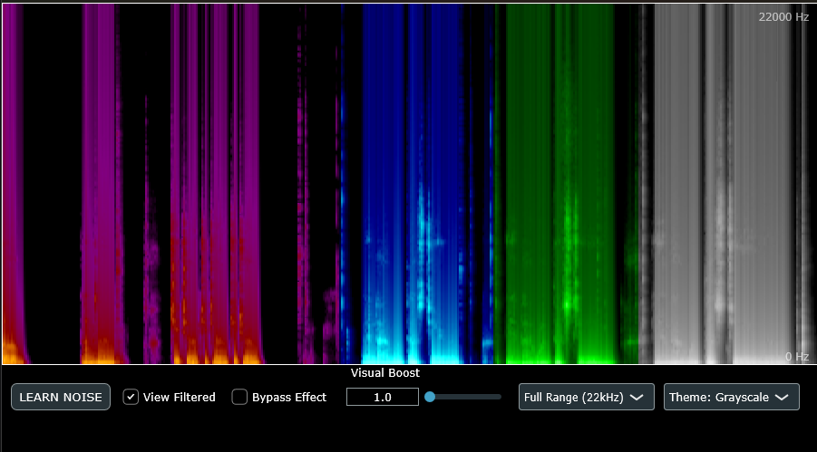

# Spectral Subtractor

**A Real-Time Spectral Subtraction VST3 Plugin & Audio Analysis Study.**

## 🎓 About The Project

**Spectral Subtractor** was developed as a deep-dive educational project to master **Digital Signal Processing (DSP)**, **C++ Audio Architecture**, and the **JUCE Framework**.

While the primary goal was to create a functional, low-latency noise reduction tool for live streaming (OBS Studio), the core motivation was to demystify how audio analysis works "under the hood." It implements a custom spectral subtraction engine from scratch—capturing environmental noise profiles, visualizing them via a scrolling spectrogram (waterfall plot), and mathematically removing them from the signal chain without destroying voice fidelity.

### 🛠️ Technical Stack
* **Language:** C++17
* **Framework:** JUCE 7
* **DSP Concepts:** Fast Fourier Transform (FFT), Windowing, Overlap-Add (OLA), Ring Buffers.
* **Architecture:** Thread-safe Consumer/Producer pattern (Audio Thread vs. GUI Thread).

## 🚀 Key Features

* **Adaptive Noise Profiling:** "Learn" mode uses averaging logic to capture a stable "fingerprint" of room tone (fans, AC) while ignoring transient spikes.
* **Real-Time Visualization:** High-performance scrolling heatmap allows users to *see* the frequency content of their audio history.
* **Visual Analysis Tools:**
    * **Variable Zoom:** Focus inspection on specific bands (e.g., Sub-bass vs. Human Speech).
    * **Visual Gain:** Post-process the visual data to reveal low-amplitude noise floors without altering the audio output.
    * **A/B Testing:** Bypass toggles to audit the subtraction algorithm in real-time.
* **Broadcast Safe:** Optimized for zero-latency monitoring with CPU-efficient circular buffering.

## 🧠 What I Learned (Engineering Highlights)

This project served as a practical application of several advanced audio programming concepts:

### 1. Digital Signal Processing (DSP)
* **The Math of Sound:** Moved beyond time-domain amplitude to frequency-domain analysis using **FFT**.
* **Windowing:** Implemented Hanning windows to mitigate spectral leakage and "clicking" at buffer boundaries.
* **Phase Coherence:** Learned the critical importance of preserving phase data during reconstruction to avoid robotic/metallic artifacts (the "underwater" effect).

### 2. Low-Level Memory Management
* **Ring Buffers:** Built a custom circular buffer implementation to bridge the gap between the host's audio block size and the FFT's required window size.
* **Crash Safety:** Solved critical "Off-by-One" memory access violations common in signal processing loops, ensuring stability even during host initialization.

### 3. VST Architecture
* **Thread Safety:** Strict separation of the **Processor** (High-priority audio thread) and the **Editor** (Low-priority UI thread).
* **Plugin Lifecycle:** Managing state, parameters, and entry points (`createPluginFilter`) for VST3 host compatibility.

## 🛠️ Development & Build Instructions

This repository tracks the source code and Projucer project file. **JUCE Library Code** and **Build artifacts** are ignored to keep the repository clean.

To build the project:

1.  **Prerequisites:** Install **JUCE 7** and ensure you have the **Projucer** application.
2.  **Generate Project Files:**
    *   Open `SpectralSubtrator.jucer` in the **Projucer**.
    *   Click **File > Save Project** (or `Ctrl + S`) to regenerate the `JuceLibraryCode` and `Builds` folders for your platform (VS2022, Xcode, etc.).
3.  **Compile:**
    *   Open the generated solution in your IDE.
    *   Build the `VST3` target in **Release** mode.

## 📥 Installation

1.  Download the latest release.
2.  Copy `SpectralSubtractor.vst3` to your system's VST3 folder:
    * **Windows:** `C:\Program Files\Common Files\VST3\`
3.  **Load in OBS Studio:**
    * **Note:** This plugin requires a VST3 wrapper to function correctly in OBS. I recommend using **atkAudio** or **Element**.
    * Right-click your Audio Source in the Mixer -> **Filters**.
    * Click **+** and add your VST Wrapper (e.g., **Vst 2.x Plug-in** -> select **atkAudio**).
    * Open the wrapper interface and load **SpectralSubtractor** from the plugin list.

## 🔮 Future Improvements

* **Transient Shaping:** Implementing transient detection to bypass noise reduction during sharp sounds (drum hits, consonants) to preserve attack.
* **Pitch Shifting:** Utilizing the existing frequency bins to implement pitch correction or alteration.
* **Neural Network Integration:** Replacing the static subtraction threshold with a lightweight ML model for dynamic voice activity detection (VAD).

## 👤 Author & Contact

**Alec Brandt (Azterisk)** - *Student & Software Developer*

I am currently a student focusing on **Software Testing, Systems Analysis, and C++ Development**. I am actively looking for opportunities to apply my skills in audio software, tool development, or systems engineering.

---
*Built with JUCE. MIT License.*
